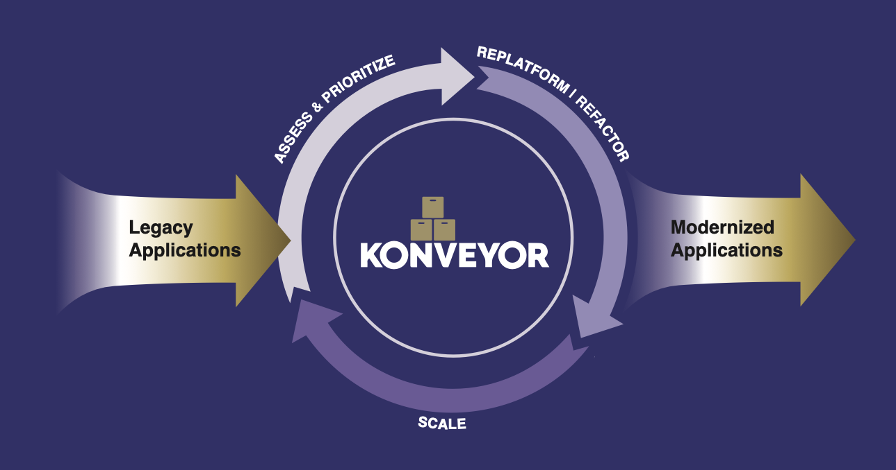

# Logo Usage Guide for Konveyor Presentations

## Official Konveyor Logos Available

### 1. Primary Header Logo (`konveyor_header.png`)
- **Usage**: Title slides, main presentations, large format displays
- **Size**: 146KB, high resolution
- **Background**: Transparent
- **Best for**: Opening slides, closing slides, main branding

### 2. Avatar/Icon Logo (`konveyor_avatar.png`) 
- **Usage**: Smaller references, slide footers, bullet points
- **Size**: 5KB, 200x200px
- **Background**: Transparent circular design
- **Best for**: Accent usage, small format references

### 3. CNCF Sandbox Badge (`cncf_icon.png`)
- **Usage**: When referencing CNCF status, credibility markers
- **Size**: 13KB
- **Purpose**: Shows Konveyor is a CNCF Sandbox project
- **Best for**: About slides, credibility sections

## Placement Guidelines

### Title Slide (Slide 1)
```markdown

# Your Presentation Title
[Presenter info]

```

### Content Slides
```markdown

## Slide Title
[Content]
```

### Closing Slide
```markdown

# Thank You!
[Contact info]
```

## PowerPoint Integration

When converting to PowerPoint with Pandoc:
1. Logos are automatically included in the presentation
2. File size increases appropriately (223KB vs 55KB without logos)
3. Images maintain quality and transparency
4. Logos are positioned as specified in markdown

## Brand Consistency

**RECOMMENDED:**
- Use official logos from Konveyor GitHub
- Maintain aspect ratios
- Include CNCF badge when appropriate
- Keep logos readable at presentation size

**AVOID:**
- Modify logo colors or design
- Stretch or distort logos
- Use low-resolution versions
- Remove copyright attribution

## Attribution

All logos used under Apache-2.0 license from:
- **Source**: Konveyor GitHub Organization
- **Repository**: https://github.com/konveyor/.github
- **License**: Apache-2.0
- **Usage**: Permitted for project-related presentations

## File Locations in Repository

```
assets/
├── logos/
│   ├── konveyor_header.png    (Primary logo)
│   ├── konveyor_avatar.png    (Icon/avatar)
│   ├── cncf_icon.png         (CNCF badge)
│   └── README.md             (This guide)
```

## PowerPoint Output

The visual slides with logos generate:
- **Filename**: `App_Modernization_Demo_Slides_Visual.pptx`
- **Size**: ~223KB (includes embedded logos)
- **Quality**: Production-ready for presentations
- **Format**: Compatible with PowerPoint, Google Slides, Keynote

---

*This ensures professional, branded presentations that properly represent the Konveyor project and its CNCF status.*