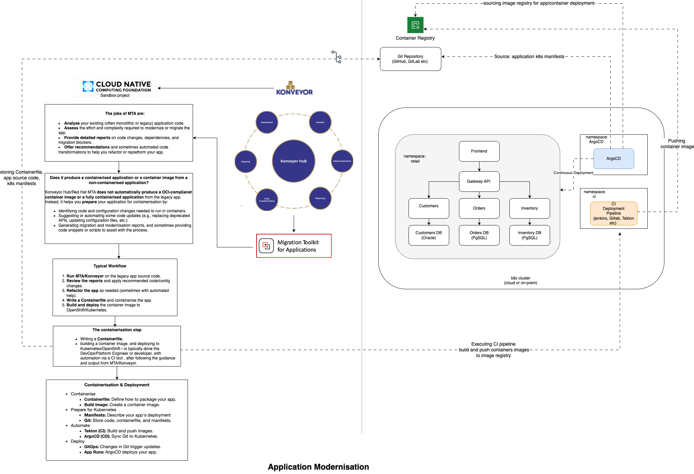

# app-modernisation-demo

## Table of Contents

- [Context: Application Modernisation and Konveyor](#context-application-modernisation-and-konveyor)
- [Why Modernise a Legacy Tomcat Application?](#why-modernise-a-legacy-tomcat-application)
- [About Konveyor and KAI](#about-konveyor-and-kai)
- [More About Konveyor](#more-about-konveyor)
- [Analysing a Legacy Java Application with Konveyor](#analysing-a-legacy-java-application-with-konveyor)
- [Next Steps After Application Analysis](#next-steps-after-application-analysis)
- [Diagram Overview](#diagram-overview)
- [Konveyor Installation Guide](#konveyor-installation-guide)
- [Troubleshooting](#troubleshooting)
- [References](#references)

---

## Context: Application Modernisation and Konveyor

Application modernisation is the process of transforming legacy software systems to leverage modern technologies, architectures, and cloud-native platforms. This enables organisations to improve scalability, reliability, security, and agility, while reducing technical debt and operational costs.

Modernisation is not a one-size-fits-all journey. The right approach depends on the application's current state, business requirements, and future goals. The most common strategies are known as the "Rs" of modernisation, and Konveyor helps teams evaluate and execute these options:

- **Rehost ("Lift and Shift")**: Move the application as-is to a new infrastructure (such as cloud or Kubernetes) with minimal or no code changes. This is the fastest way to migrate workloads, reducing risk and effort, but does not address underlying technical debt or take full advantage of cloud-native features.
  - *Use-case:* Migrating a legacy Java application from a physical server to a Kubernetes cluster without changing the code, just containerising and deploying.

- **Replatform ("Lift, Tinker, and Shift")**: Move the application to a new platform, making small changes to leverage platform features (such as containerisation, managed databases, or environment variable-based configuration). This approach improves manageability and scalability without a full rewrite.
  - *Use-case:* Updating a Java application to use environment variables for configuration and deploying it on Kubernetes, but keeping the application's structure the same.

- **Refactor ("Re-architect")**: Make significant changes to the application's code or architecture to improve maintainability, scalability, or performance, or to adopt cloud-native patterns. Refactoring may involve breaking up monoliths into microservices, adopting new frameworks, or redesigning for cloud-native best practices. This approach delivers the greatest long-term benefits but requires more time and investment.
  - *Use-case:* Splitting a monolithic Java application into microservices, adopting Spring Boot, and redesigning for cloud-native deployment.

- **Repurchase ("Drop and Shop")**: Replace the existing application with a new, often SaaS-based, solution that provides similar or improved functionality.
  - *Use-case:* Replacing a custom-built CRM system with Salesforce or another SaaS CRM platform.

- **Retire**: Decommission the application because it is no longer needed or its functionality is duplicated elsewhere.
  - *Use-case:* Shutting down an old reporting tool that is no longer accessed because its functionality has been replaced by a newer analytics platform.

Konveyor provides automated analysis, actionable recommendations, and tools to help teams choose and implement the best modernisation strategy for each application. By supporting rehosting, replatforming, refactoring, repurchasing, and retiring, Konveyor enables organisations to modernise at their own pace and according to their unique needs.

---

## Why Modernise a Legacy Tomcat Application?

Many organisations still rely on legacy Java applications running on platforms like Apache Tomcat, such as the [example-1 application](https://github.com/konveyor/example-applications/tree/main/example-1) used in this demo. These applications often support critical business processes but present several challenges in modern IT environments:

- **Operational Complexity:** Legacy Tomcat applications are typically deployed on physical servers or VMs, requiring manual management, patching, and scaling.
- **Limited Scalability:** Scaling to meet demand is difficult and often requires significant infrastructure changes.
- **Security Risks:** Older platforms may lack modern security features and are harder to keep up-to-date with patches.
- **High Maintenance Costs:** Maintaining legacy environments can be expensive due to ageing hardware, software licences, and specialised skills.
- **Lack of Agility:** Integrating with modern cloud services, CI/CD pipelines, or adopting DevOps practices is challenging with legacy architectures.
- **Technical Debt:** Over time, customisations and outdated dependencies accumulate, making the application harder to maintain and evolve.

**Modernisation**—using tools like Konveyor—enables organisations to address these challenges by:
- Migrating legacy applications to cloud-native platforms (like Kubernetes).
- Improving scalability, reliability, and security.
- Reducing operational costs and technical debt.
- Enabling faster development cycles and easier integration with modern services.

By analysing a legacy Tomcat application with Konveyor, you can identify modernisation opportunities, receive actionable recommendations, and plan a migration path that aligns with your business goals—transforming your legacy workloads into agile, cloud-ready solutions.

---

## About Konveyor and KAI

**Konveyor** is an open-source toolkit designed to accelerate and simplify the application modernisation journey. It provides automated analysis, actionable recommendations, and tools to help teams migrate, refactor, and replatform legacy applications for cloud-native environments. Konveyor modules like **Tackle** analyse application source code, identify modernisation opportunities, and generate migration assets such as Dockerfiles and Kubernetes manifests. This enables organisations to assess their application portfolios, understand technical debt, and plan effective modernisation strategies.

**Migration Toolkit for Applications (MTA)** is a Red Hat product built on the upstream open-source Konveyor project. MTA provides enterprise support and additional features, making it suitable for organisations seeking a supported solution for application modernisation.  
For this demo, MTA was used to analyse and modernise a legacy Java application for a potential client.  
Learn more: [MTA Overview](https://developers.redhat.com/products/mta/overview)

**KAI (Konveyor AI)** is an AI-powered extension of Konveyor that brings advanced code analysis and intelligent modernisation recommendations to the process.  
KAI leverages large language models (LLMs) and AI techniques to deeply analyse application source code, configuration, and architecture. It goes beyond traditional static analysis by understanding code semantics, business logic, and modernisation patterns. KAI can identify migration blockers, suggest refactoring opportunities, and recommend cloud-native architectures tailored to your application's needs.

**Key features of KAI include:**
- **Deep Code Understanding:** Uses AI to interpret code structure, dependencies, and business logic.
- **Modernisation Recommendations:** Provides actionable suggestions for refactoring, replatforming, and containerisation.
- **Migration Blocker Detection:** Identifies issues that may hinder cloud migration or modernisation.
- **Contextual Guidance:** Offers insights based on your application's unique context, not just generic rules.
- **Continuous Learning:** Improves recommendations over time as it learns from more codebases and modernisation projects.

By integrating KAI into your workflow, you gain deeper insights and smarter guidance, making it easier to modernise legacy applications and adopt cloud-native best practices.  
KAI helps organisations move beyond manual analysis, enabling faster, more accurate, and more confident modernisation decisions.

Together, **Konveyor and KAI** help organisations:
- Analyse legacy applications and identify modernisation opportunities.
- Automate the generation of migration assets for containers and Kubernetes.
- Receive AI-driven recommendations for refactoring, replatforming, and improving code quality.
- Accelerate the journey to cloud-native architectures with confidence and efficiency.

> For more details, see the [KAI Deep Dive blog post](https://konveyor.io/blog/2024/kai-deep-dive-2024/).

---

## More About Konveyor

[Konveyor](https://konveyor.io/) is an open-source community and toolkit focused on accelerating application modernisation. The project provides a set of tools, methodologies, and best practices to help organisations migrate, refactor, and replatform their legacy applications for cloud-native environments.

Konveyor’s approach is guided by the [Konveyor Methodology](https://github.com/konveyor/methodology), which offers a structured framework for modernisation projects. This methodology helps teams assess their application portfolios, prioritise modernisation efforts, and choose the right strategy (such as rehosting, replatforming, or refactoring) for each application.

### Key Principles of the Konveyor Methodology

- **Portfolio Assessment:**  
  Analyse and categorise applications based on business value, technical debt, and modernisation complexity.

- **Modernisation Strategies:**  
  Apply the "5 Rs" (Rehost, Replatform, Refactor, Repurchase, Retire) to select the most suitable modernisation path for each application.

- **Automated Analysis:**  
  Use tools like Konveyor Tackle and KAI to automate code analysis, identify migration blockers, and generate actionable recommendations.

- **Incremental Transformation:**  
  Modernise applications in stages, starting with quick wins and progressing to deeper architectural changes as needed.

- **Collaboration and Documentation:**  
  Encourage cross-functional collaboration and maintain clear documentation throughout the modernisation journey.

### Konveyor Toolkit

- **Tackle:** Automated analysis and migration planning for application portfolios.
- **KAI:** AI-powered code analysis and modernisation recommendations.
- **Move2Kube:** Automated containerisation and Kubernetes deployment asset generation.
- **Forklift:** Infrastructure migration for virtual machines and workloads.

### Why Use Konveyor?

- **Accelerate Modernisation:** Reduce manual effort and risk with automated tools and proven methodologies.
- **Cloud-Native Readiness:** Prepare legacy applications for containers, Kubernetes, and cloud platforms.
- **Community-Driven:** Benefit from open-source innovation and shared best practices.
- **End-to-End Guidance:** From assessment to migration, Konveyor supports every step of the modernisation process.

For more details, see the [Konveyor Methodology repository](https://github.com/konveyor/methodology) and [Konveyor website](https://konveyor.io/).

---

This project demonstrates application modernisation using [Migration Toolkit for Applications (MTA)](https://developers.redhat.com/products/mta/overview), built on upstream [Konveyor](https://konveyor.io/), on a local Kubernetes cluster with [minikube](https://minikube.sigs.k8s.io/).  
It includes step-by-step instructions for setting up Konveyor and modernising Java applications, including the Spring PetClinic and a sample legacy Java application.

> **References followed:**  
> - [Konveyor Official Docs](https://konveyor.io/docs/konveyor/installation/)  
> - [Kube by Example: Install Konveyor and Analyse Legacy Java Application](https://kubebyexample.com/learning-paths/migrating-kubernetes/install-konveyor-and-analyse-legacy-java-application)  
> - [Konveyor Operator Installation (macOS)](https://github.com/konveyor/operator/blob/main/docs/installation-macos.md)

---

## Analysing a Legacy Java Application with Konveyor

This section demonstrates how to analyse a legacy Java application using Konveyor (and MTA), following the ["Let's Get Started with Analysis Module"](https://kubebyexample.com/learning-paths/migrating-kubernetes/install-konveyor-and-analyse-legacy-java-application) guideline.  
_Note: In the latest Konveyor UI, analysis results may appear under the **Issues** tab rather than a dedicated Reports section._

### Step 1: Create an Application Entry in Konveyor

1. In the Konveyor UI, go to the **Analysis** tab and click **Create Application**.
2. Fill in the application details:
    - **Name:** `customer-tomcat`
3. Expand the **Source Code** section and enter the following:
    - **Repository Type:** `Git`
    - **Source Repository:** `https://github.com/konveyor/example-applications`
    - **Branch:** `main`
    - **Root path:** `/example-1/`
4. Click the **Create** button.

### Step 2: Run an Analysis

1. In the Konveyor UI, select the `customer-tomcat` application you just created.
2. Click **Analyse** (or **Create Analysis**).
3. Choose relevant targets (e.g., **Containerisation**, **Kubernetes**).
4. (Optional) Select migration rules if applicable.
5. Click **Run Analysis**.
6. Monitor progress in the UI or with:
    ```bash
    kubectl logs -l app=tackle-analyzer -n my-konveyor-operator -f
    ```

### Step 3: Review Analysis Results

- After the analysis completes, go to your application's **Issues** tab in the Konveyor UI (not the Reports section).
- Review the list of issues and recommendations.

#### Example Issues and How to Address Them

##### 1. File System - Java IO

**Issue:**  
The application reads configuration from a file inside the container, e.g.:
```java
try (InputStream inputStream = new FileInputStream("/opt/config/persistence.properties")) {
    properties.load(inputStream);
}
```
**Why it's a problem:**  
- Container file systems are ephemeral; files may be lost on restart or redeploy.
- Hardcoded file paths make configuration updates difficult and less portable.

**How to modernise:**  
How you address this depends on the function of the file in local storage:

- **Logging:** Log to standard output and use a centralised log collector to analyse the logs.
- **Caching:** Use a cache backing service (such as Redis or Memcached) instead of writing cache data to the local file system.
- **Configuration:** Store configuration settings in environment variables or mount them into the container using Kubernetes ConfigMaps, so they can be updated without code changes.
- **Data storage:** Use a database backing service for relational data or a persistent data storage system, rather than writing to local files.
- **Temporary data storage:** Use the file system of a running container only for brief, single-transaction caches or temporary files that can be safely lost if the container restarts.
- Use **environment variables** for configuration, or mount configuration files using **Kubernetes ConfigMaps**.

**Example (ConfigMap as file):**
```yaml
apiVersion: v1
kind: ConfigMap
metadata:
  name: app-config
data:
  persistence.properties: |
    key1=value1
    key2=value2
---
apiVersion: apps/v1
kind: Deployment
spec:
  template:
    spec:
      containers:
      - name: your-app
        volumeMounts:
        - name: config-volume
          mountPath: /opt/config
      volumes:
      - name: config-volume
        configMap:
          name: app-config
```
Or, refactor your Java code to read from environment variables.

---

##### 2. Hardcoded IP Address

**Issue:**  
The application uses a hardcoded IP address in its configuration, e.g.:
```properties
jdbc.url=jdbc:oracle:thin:@169.60.225.216:1521/XEPDB1
```
**Why it's a problem:**  
- Hardcoded IPs make the app less portable and harder to move between environments.
- If the database IP changes, you must rebuild or manually edit your config.

**How to modernise:**  
- Use **environment variables** or **Kubernetes ConfigMaps/Secrets** for connection info.
- Reference your database by **Kubernetes Service DNS name** instead of an IP.

**Example:**
```properties
jdbc.url=jdbc:oracle:thin:@oracle-db-service:1521/XEPDB1
```
Where `oracle-db-service` is the name of your Kubernetes Service for the database.

---

### Summary Table

| Issue                | Why It’s a Problem                | Best Practice                                   |
|----------------------|-----------------------------------|-------------------------------------------------|
| File system Java IO  | Ephemeral storage, hard to update | Use env vars or ConfigMaps for configuration    |
| Hardcoded IP Address | Not portable, hard to maintain    | Use env vars/ConfigMaps, reference by DNS name  |

---

## Next Steps After Application Analysis

The following diagram illustrates the workflow after application analysis:


*Figure: What to do after an application is reviewed and analysed by Konveyor*

---

## Diagram Overview

The diagram presents a well-structured workflow for modernising legacy applications using the Migration Toolkit for Applications ([MTA](https://developers.redhat.com/products/mta/overview)) and Konveyor Hub, followed by containerisation and deployment via CI/CD pipelines. It effectively maps out the journey from legacy code to cloud-native deployment.

### Key Components & Flow

**1. Migration Toolkit for Applications (MTA)**
- **Purpose:** Analyses legacy code, assesses modernisation effort, and generates actionable reports.
- **Strengths:**
  - Clear emphasis on automated code transformation.
  - Highlights dependency analysis and configuration updates.
- *Suggestion:* Consider adding examples of supported legacy platforms ([Java EE](https://www.oracle.com/java/technologies/java-ee-glance.html), [.NET](https://dotnet.microsoft.com/en-us/learn/dotnet/what-is-dotnet)) for clarity.

**2. Konveyor Hub**
- **Structure:** Centralised with six spokes—Assessment, Planning, Analysis & Transformation, Reports, Integration & Automation, Execution.
- **Strengths:**
  - Nicely encapsulates the lifecycle of modernisation.
  - Shows how MTA integrates into a broader ecosystem.
- *Suggestion:* A brief note on how Konveyor Hub interfaces with external tools (e.g., IDEs or CI platforms) could enhance understanding.

**3. Typical Workflow**
- **Steps:** Run MTA → Review reports → Apply changes → Refactor → Containerise.
- **Strengths:** Logical and easy to follow.
- *Suggestion:* You might want to visually differentiate manual vs. automated steps for clarity.

**4. Containerisation & CI/CD**
- **Tools Used:** Build Manager, Git Store, Automation Tools, Tekton, ArgoCD.
- **Strengths:**
  - Shows end-to-end pipeline from code to deployment.
  - Includes both CI (build/push) and CD (deploy via ArgoCD).
- *Suggestion:* Consider adding security scanning or testing stages (e.g., [Trivy](https://aquasecurity.github.io/trivy/), [SonarQube](https://www.sonarqube.org/)) to reflect best practices.

**5. Namespaces: Retail & ArgoCD**
- **Retail Namespace:**
  - Illustrates a microservices architecture with frontend, gateway API, and multiple DBs (Oracle, PgSQL).
- **ArgoCD Namespace:**
  - Demonstrates automated deployment.
- **Strengths:** Good use of real-world examples.
- *Suggestion:* Label the communication flow between services (e.g., REST, gRPC) for completeness.

---

## Konveyor Installation Guide

_Follow these steps to set up Konveyor on minikube for application modernisation._

### Prerequisites

- **Docker**: For building and running containers  
  [Install Docker for Mac](https://docs.docker.com/desktop/install/mac/)
- **minikube**: For running a local Kubernetes cluster  
  [Install minikube](https://minikube.sigs.k8s.io/docs/start/)
- **kubectl**: For interacting with Kubernetes  
  [Install kubectl](https://kubernetes.io/docs/tasks/tools/)

#### Quick Install Commands (for Apple Silicon)

```bash
# Install minikube
curl -LO https://github.com/kubernetes/minikube/releases/latest/download/minikube-darwin-arm64
sudo install minikube-darwin-arm64 /usr/local/bin/minikube

# Install kubectl
curl -LO "https://dl.k8s.io/release/$(curl -L -s https://dl.k8s.io/release/stable.txt)/bin/darwin/arm64/kubectl"
sudo install -o root -g wheel -m 0755 kubectl /usr/local/bin/kubectl
```
> **Note:** Adjust the download URLs if you are using Intel-based Macs or Linux.

---

### Start Minikube

Initialise a minikube cluster with sufficient resources:

```bash
minikube start --cpus=4 --memory=8192 --disk-size=40g -p konveyor-demo
minikube addons enable ingress
minikube addons enable olm
```

If the OLM addon is not available or fails, install OLM manually:
```bash
kubectl apply -f https://github.com/operator-framework/operator-lifecycle-manager/releases/latest/download/install.yaml
```

---

### Install Konveyor Operator

```bash
kubectl create -f https://operatorhub.io/install/konveyor-operator.yaml
```

---

### Verify Operator Installation

```bash
# Check that the operator pod is running
kubectl get pods -n my-konveyor-operator

# Check that the Tackle CRD is installed
kubectl get crds | grep tackle
```
You should see a pod like `tackle-operator-xxxx` in the `Running` state and a CRD named `tackles.tackle.konveyor.io`.

---

### Deploy Tackle Custom Resource

```bash
cat <<EOF | kubectl apply -f -
apiVersion: tackle.konveyor.io/v1alpha1
kind: Tackle
metadata:
  name: tackle
  namespace: my-konveyor-operator
spec:
  feature_auth_required: false
EOF
```

---

### Verify Tackle Deployment

```bash
# Check that the Tackle custom resource exists
kubectl get tackle -n my-konveyor-operator

# Check that all pods are running
kubectl get pods -n my-konveyor-operator

# Check that the required services are available
kubectl get svc -n my-konveyor-operator
```
You should see:
- A `tackle` resource listed.
- All pods (`tackle-operator`, `tackle-ui`, `tackle-hub`, etc.) in the `Running` state.
- Services `tackle-ui` and `tackle-hub` available.

---

### Access the Konveyor UI

Set up port forwarding to access the UI:

```bash
kubectl port-forward svc/tackle-ui 8080:8080 -n my-konveyor-operator
```
Open your browser and navigate to [http://localhost:8080](http://localhost:8080).

---

### Important Notes

- Ensure you have at least **8GB RAM** and **40GB disk space** available.
- The installation process may take **10-15 minutes** depending on your internet connection.
- Keep the port-forward command running to access the UI.

---

## Troubleshooting

- Ensure all pods in the `my-konveyor-operator` namespace are running.
- If you encounter issues, check logs with:
  ```bash
  kubectl logs <pod-name> -n my-konveyor-operator
  ```
- For more help, see the [Konveyor documentation](https://konveyor.github.io/tackle2-operator/).

---

## References

### Documentation
- [Migration Toolkit for Applications (MTA)](https://developers.redhat.com/products/mta/overview)
- [Konveyor Tackle2 Operator](https://github.com/konveyor/tackle2-operator)
- [Konveyor Official Docs](https://konveyor.io/docs/konveyor/installation/)
- [Konveyor Methodology](https://github.com/konveyor/methodology)
- [Minikube Documentation](https://minikube.sigs.k8s.io/docs/)
- [KAI Deep Dive blog post](https://konveyor.io/blog/2024/kai-deep-dive-2024/)

### Examples & Learning Paths
- [Spring PetClinic](https://github.com/spring-projects/spring-petclinic)
- [Kube by Example: Install Konveyor and Analyse Legacy Java Application](https://kubebyexample.com/learning-paths/migrating-kubernetes/install-konveyor-and-analyse-legacy-java-application)

### Supported Platforms
- [Java EE Overview](https://www.oracle.com/java/technologies/java-ee-glance.html)
- [.NET Overview](https://dotnet.microsoft.com/en-us/learn/dotnet/what-is-dotnet)

### Security Best Practices
- [Trivy - Vulnerability Scanner](https://aquasecurity.github.io/trivy/)


