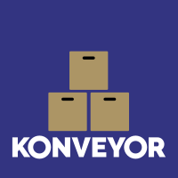
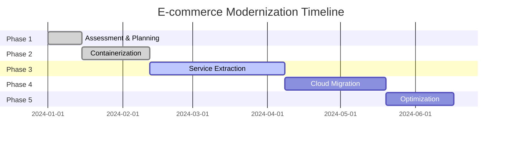
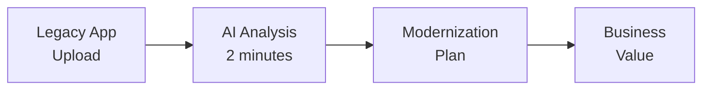

---
# Application Modernisation Journey - From Legacy to Cloud Native

*Using Konveyor to Accelerate Transformation*

---

## Slide 1: Title & Introduction


# Application Modernisation
## From Monolith to Microservices

**Mezba Rahman**  
Platform Engineer | CIS Capgemini

**Cloud Native Kubernetes Virtual Meetup**  
*October 10th, 2025*

---

## Slide 2: The Digital Transformation Challenge


### The Business Reality
**Companies need to move fast, but legacy systems hold them back**

---

---
## Slide 3: Legacy Application Landscape

```ascii
TYPICAL ENTERPRISE (Fortune 500)

APPLICATION PORTFOLIO:
├── 2,000+ Applications
├── 70% Built 10+ Years Ago
├── Multiple Technologies
└── Critical Business Logic

CURRENT CHALLENGES:
├── $2M Annual Maintenance
├── 6-Month Release Cycles
├── Security Vulnerabilities
└── Talent Retention Issues
```

**Sound familiar?**

---

---
## Slide 4: Modernisation Business Drivers

### Why Modernise Now?


---

---
## Slide 5: The Modernisation Spectrum


### Which Path for Your Applications?

---

---
## Slide 6: The Assessment Problem

### Traditional Approach: Manual Analysis

```ascii
MANUAL ASSESSMENT APPROACH:
- Team of 5 Architects
- 6 weeks per application
- 200+ page documents
- $50,000+ per assessment

PROBLEMS:
├── Inconsistent Results
├── Human Error Prone
├── Doesn't Scale
└── Misses Hidden Dependencies
```

**There has to be a better way...**

---

---
## Slide 7: AI-Powered Assessment (Konveyor)



### Meet Your Modernisation Assistant


**Konveyor: Open-source modernisation platform**

---

---
## Slide 8: Real-World Example (Case Study)

### Case Study: E-commerce Platform

#### Before Modernization
```ascii
MONOLITHIC ARCHITECTURE:
├── Single Java WAR (50GB)
├── Oracle Database
├── Physical Servers
└── 6-month Release Cycle

BUSINESS IMPACT:
├── $500K/month Infrastructure
├── 2-day Deployment Process
├── Cannot Handle Black Friday
└── 5 Critical Outages/Year
```

---

---
## Slide 9: Transformation Journey

### Step 1: Assessment & Discovery


**Result: Clear path forward in 2 hours vs 6 weeks**

---

---
## Slide 10: Architecture Evolution (Before/After)

### Before: Monolithic Deployment

```ascii
┌─────────────────────────────────────┐
│           Physical Server           │
├─────────────────────────────────────┤
│  [APP] E-commerce App (50GB WAR)     │
│  ├── User Management               │
│  ├── Product Catalog              │
│  ├── Shopping Cart                │
│  ├── Payment Processing           │
│  └── Order Management             │
│                                   │
│  [DB] Oracle Database (On-premise)   │
└─────────────────────────────────────┘
```

---

---
## Slide 11: Target Architecture (Cloud-Native)

### After: Cloud-Native Microservices

```ascii
┌─────────────────────────────────────────────┐
│              Kubernetes Cluster             │
├─────────────────────────────────────────────┤
│  [SVC] Users  [SVC] Products [SVC] Cart     │
│  Service      Service       Service         │
│                                             │
│  [SVC] Payment [SVC] Orders [SVC] Gateway  │
│  Service       Service      Service         │
│                                             │
│  [DB] Managed Database [MON] Monitoring    │
│                        [SEC] Security      │
└─────────────────────────────────────────────┘
```

---

---
## Slide 12: Migration Strategy & Timeline

### Incremental Modernization Plan



**Total: 6 months (vs 2 years traditional)**

---

---
## Slide 13: Business Impact (Before vs After)

### Transformation Results

| Metric | Before | After | Improvement |
|--------|---------|--------|-------------|
| **Deployment** | 2 days | 5 minutes | **99.8%** faster |
| **Infrastructure** | $500K/month | $150K/month | **70%** reduction |
| **Scalability** | Fixed capacity | Auto-scale | **10x** peak handling |
| **Releases** | 2 per year | 50+ per year | **25x** frequency |
| **Downtime** | 5 incidents/year | 0.1 incidents/year | **98%** reliability |

---

---
## Slide 14: Demo Preview & Results Overview

### What We'll See Today



#### Demo Application
- **Type**: Java Spring Boot Monolith
- **Complexity**: Medium (typical enterprise app)
- **Goal**: Kubernetes readiness assessment

**Let's see AI-powered modernisation in action!**

---

---
## Slide 15: Key Modernisation Patterns & Success Factors

### Assessment Complete

```ascii
MODERNIZATION READINESS SCORE: 85/100

RECOMMENDED PATH: Containerization → Kubernetes
ESTIMATED TIMELINE: 3-4 weeks  
EXPECTED ROI: 300% in 12 months
MIGRATION CONFIDENCE: High

RESULT: Ready for Cloud Native Transformation
```

**From assessment to deployment plan in minutes**

---


---
## Slide 16: Q&A & Thank You / Contact

# Q&A - Your Modernisation Challenges

### Common Questions:
- How to build the business case?
- Which applications to modernise first?
- How to handle legacy dependencies?
- What about data migration strategies?

**Share your modernisation experiences!**

---


# Start Your Modernisation Journey Today

### Connect & Learn More

**Mezba Rahman**  
Platform Engineer | CIS Capgemini  
📧 mezba.rahman@capgemini.com

### Connect & Follow

🔗 **LinkedIn:** [linkedin.com/in/mezba](https://www.linkedin.com/in/mezba/)  
📝 **Technical Blog:** [medium.com/@mezba](https://medium.com/@mezba)  
💼 **Expertise:** Platform Engineering, App Modernisation, Cloud-Native Architecture

### Resources

**Konveyor Project**: https://konveyor.io  
**Modernisation Guides**: https://konveyor.io/docs  
**This Demo**: github.com/my-janala/app-modernisation-demo

 **CNCF Sandbox Project**