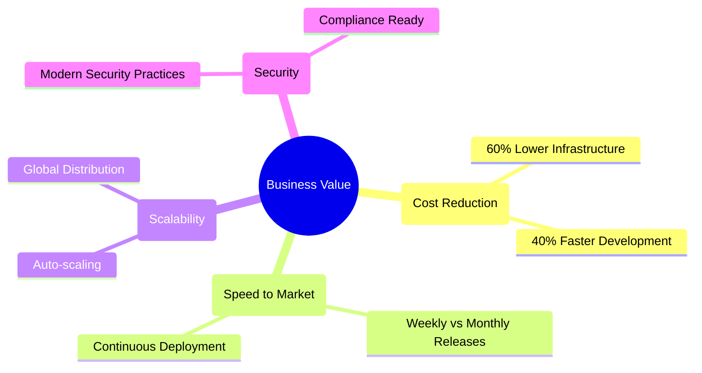
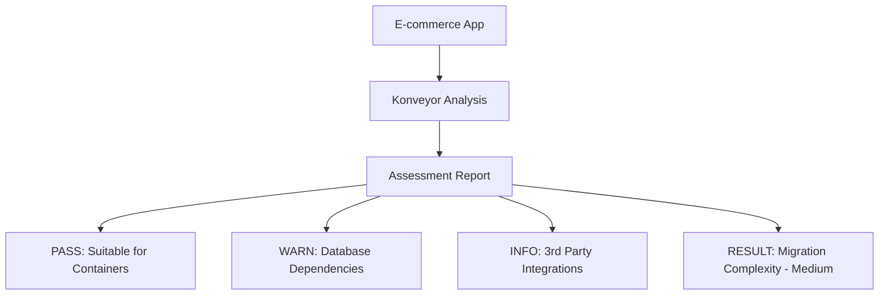
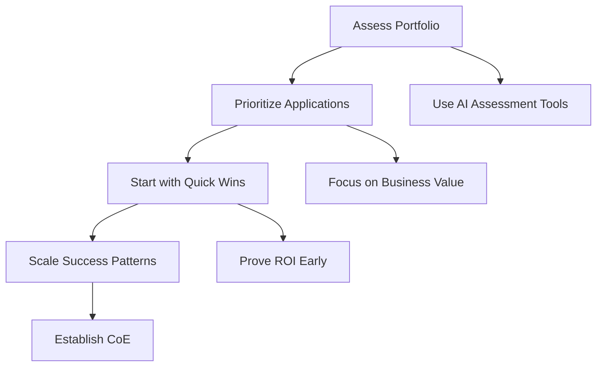

# Application Modernization Journey - From Legacy to Cloud Native

*Using Konveyor to Accelerate Transformation*

---

## Slide 1: Title


# Application Modernization
## From Monolith to Microservices

**Mezba Rahman**  
Platform Engineer | CIS Capgemini

**Cloud Native Kubernetes Virtual Meetup**  
*October 10th, 2025*

---

## Slide 2: The Digital Transformation Challenge


### The Business Reality
**Companies need to move fast, but legacy systems hold them back**

---

## Slide 3: Legacy Application Landscape

```ascii
TYPICAL ENTERPRISE (Fortune 500)

APPLICATION PORTFOLIO:
├── 2,000+ Applications
├── 70% Built 10+ Years Ago
├── Multiple Technologies
└── Critical Business Logic

CURRENT CHALLENGES:
├── $2M Annual Maintenance
├── 6-Month Release Cycles
├── Security Vulnerabilities
└── Talent Retention Issues
```

**Sound familiar?**

---

## Slide 4: Modernization Business Drivers

### Why Modernize Now?



---

## Slide 5: The Modernization Spectrum


### Which Path for Your Applications?

---

## Slide 6: The Assessment Problem

### Traditional Approach: Manual Analysis

```ascii
MANUAL ASSESSMENT APPROACH:
- Team of 5 Architects
- 6 weeks per application
- 200+ page documents
- $50,000+ per assessment

PROBLEMS:
├── Inconsistent Results
├── Human Error Prone
├── Doesn't Scale
└── Misses Hidden Dependencies
```

**There has to be a better way...**

---

## Slide 7: Enter AI-Powered Assessment


### Meet Your Modernization Assistant


**Konveyor: Open-source modernization platform**

---

## Slide 8: Real-World Modernization Example

### Case Study: E-commerce Platform

#### Before Modernization
```ascii
MONOLITHIC ARCHITECTURE:
├── Single Java WAR (50GB)
├── Oracle Database
├── Physical Servers
└── 6-month Release Cycle

BUSINESS IMPACT:
├── $500K/month Infrastructure
├── 2-day Deployment Process
├── Cannot Handle Black Friday
└── 5 Critical Outages/Year
```

---

## Slide 9: Transformation Journey

### Step 1: Assessment & Discovery



**Result: Clear path forward in 2 hours vs 6 weeks**

---

## Slide 10: Architecture Evolution

### Before: Monolithic Deployment

```ascii
┌─────────────────────────────────────┐
│           Physical Server           │
├─────────────────────────────────────┤
│  [APP] E-commerce App (50GB WAR)     │
│  ├── User Management               │
│  ├── Product Catalog              │
│  ├── Shopping Cart                │
│  ├── Payment Processing           │
│  └── Order Management             │
│                                   │
│  [DB] Oracle Database (On-premise)   │
└─────────────────────────────────────┘
```

---

## Slide 11: Target Architecture

### After: Cloud-Native Microservices

```ascii
┌─────────────────────────────────────────────┐
│              Kubernetes Cluster             │
├─────────────────────────────────────────────┤
│  [SVC] Users  [SVC] Products [SVC] Cart     │
│  Service      Service       Service         │
│                                             │
│  [SVC] Payment [SVC] Orders [SVC] Gateway  │
│  Service       Service      Service         │
│                                             │
│  [DB] Managed Database [MON] Monitoring    │
│                        [SEC] Security      │
└─────────────────────────────────────────────┘
```

---

## Slide 12: Migration Strategy

### Incremental Modernization Plan


**Total: 6 months (vs 2 years traditional)**

---

## Slide 13: Business Impact - Before vs After

### Transformation Results

| Metric | Before | After | Improvement |
|--------|---------|--------|-------------|
| **Deployment** | 2 days | 5 minutes | **99.8%** faster |
| **Infrastructure** | $500K/month | $150K/month | **70%** reduction |
| **Scalability** | Fixed capacity | Auto-scale | **10x** peak handling |
| **Releases** | 2 per year | 50+ per year | **25x** frequency |
| **Downtime** | 5 incidents/year | 0.1 incidents/year | **98%** reliability |

---

## Slide 14: Live Demo Preview

### What We'll See Today


#### Demo Application
- **Type**: Java Spring Boot Monolith
- **Complexity**: Medium (typical enterprise app)
- **Goal**: Kubernetes readiness assessment

**Let's see AI-powered modernization in action!**

---

## Slide 15: Demo Results Overview

### Assessment Complete

```ascii
MODERNIZATION READINESS SCORE: 85/100

RECOMMENDED PATH: Containerization → Kubernetes
ESTIMATED TIMELINE: 3-4 weeks  
EXPECTED ROI: 300% in 12 months
MIGRATION CONFIDENCE: High

RESULT: Ready for Cloud Native Transformation
```

**From assessment to deployment plan in minutes**

---

## Slide 16: Key Modernization Patterns

### What Makes Applications Cloud-Ready?


**Modern patterns for resilient applications**

---

## Slide 17: Modernization ROI Calculator

### Business Value Metrics


**Typical modernization pays for itself in 6-8 months**

---

## Slide 18: Getting Started Journey

### Your Modernization Roadmap



---

## Slide 19: Success Factors

### What Makes Modernization Successful?

```ascii
EXECUTIVE SPONSORSHIP
   └── Clear business objectives

CROSS-FUNCTIONAL TEAMS  
   └── DevOps culture adoption

RIGHT TOOLS & PLATFORMS
   └── AI-powered assessment

MEASURE EVERYTHING
   └── ROI tracking & optimization

SKILLS DEVELOPMENT
   └── Cloud-native expertise
```

---

## Slide 20: Common Pitfalls to Avoid

### Modernization Anti-Patterns

**AVOID: Big Bang Approach**  
   *Solution: Incremental migration*

**AVOID: Lift & Shift Everything**  
   *Solution: Assess first, then choose path*

**AVOID: Ignoring Data Strategy**  
   *Solution: Database modernization plan*

**AVOID: Skipping Observability**  
   *Solution: Monitoring from day one*

**AVOID: Forgetting Security**  
   *Solution: Security by design*

---

## Slide 21: Industry Trends & Future

### The Modernization Wave


**Organizations that modernize today lead tomorrow**

---

## Slide 22: Your Next Steps

### Ready to Start Your Modernization Journey?

#### Immediate Actions:
1. **Inventory Your Applications** - What do you have?
2. **Assess Modernization Readiness** - What's possible?
3. **Prioritize by Business Value** - What matters most?
4. **Start Small & Learn** - Quick wins build momentum

#### Tools to Help:
- **Konveyor** for AI-powered assessment
- **Business case templates**
- **Community best practices**

---

## Slide 23: Q&A & Discussion

# Q&A - Your Modernization Challenges

### Common Questions:
- How to build the business case?
- Which applications to modernize first?
- How to handle legacy dependencies?
- What about data migration strategies?

**Share your modernization experiences!**

---

## Slide 24: Thank You & Connect


# Start Your Modernization Journey Today

### Connect & Learn More

**Mezba Rahman** - mezba.rahman@capgemini.com  
**Platform Engineering, CIS Capgemini**

### Resources

**Konveyor Project**: https://konveyor.io  
**Modernization Guides**: https://konveyor.io/docs  
**This Demo**: github.com/my-janala/app-modernisation-demo

 **CNCF Sandbox Project**

---

## Backup Slide 25: Technology Deep Dive

### How AI Assessment Works


---

## Backup Slide 26: Modernization Checklist

### Pre-Migration Assessment

COMPLETE: **Application Inventory Complete**  
COMPLETE: **Dependencies Mapped**  
COMPLETE: **Business Value Prioritized**  
COMPLETE: **Team Skills Assessed**  
COMPLETE: **Target Architecture Defined**  
COMPLETE: **Success Metrics Established**  
COMPLETE: **Risk Mitigation Planned**  

---

## Backup Slide 27: ROI Model Details

### Detailed Cost-Benefit Analysis

#### Investment:
- Assessment & Planning: $50K
- Development & Migration: $200K  
- Training & Change Management: $75K
- **Total**: $325K

#### Annual Benefits:
- Infrastructure Cost Reduction: $400K
- Development Productivity: $300K
- Operational Efficiency: $200K
- **Total Annual**: $900K

**Payback Period: 4.3 months**