# Application Modernization Journey - From Legacy to Cloud Native

*Using Konveyor to Accelerate Transformation*

---

## Slide 1: Title


# Application Modernization
## From Monolith to Microservices

**Mezba Rahman**  
Platform Engineer | CIS Capgemini

**Cloud Native Kubernetes Virtual Meetup**  
*October 10th, 2025*

---

## Slide 2: The Digital Transformation Challenge


### The Business Reality
**Companies need to move fast, but legacy systems hold them back**

---

## Slide 3: Legacy Application Landscape

```ascii
🏢 Typical Enterprise (Fortune 500)

📊 Application Portfolio:
├── 2,000+ Applications
├── 70% Built 10+ Years Ago
├── Multiple Technologies
└── Critical Business Logic

⚠️  Current Challenges:
├── $2M Annual Maintenance
├── 6-Month Release Cycles
├── Security Vulnerabilities
└── Talent Retention Issues
```

**Sound familiar?**

---

## Slide 4: Modernization Business Drivers

### Why Modernize Now?

```mermaid
mindmap
  root((Business Value))
    (💰 Cost Reduction)
      60% Lower Infrastructure
      40% Faster Development
    (🚀 Speed to Market)
      Weekly vs Monthly Releases
      Continuous Deployment
    (📈 Scalability)
      Auto-scaling
      Global Distribution
    (🔒 Security)
      Modern Security Practices
      Compliance Ready
```



---

## Slide 5: The Modernization Spectrum


### Which Path for Your Applications?

---

## Slide 6: The Assessment Problem

### Traditional Approach: Manual Analysis

```ascii
👥 Team of 5 Architects
⏱️  6 weeks per application
📋 200+ page documents
💰 $50,000+ per assessment

❌ Problems:
├── Inconsistent Results
├── Human Error Prone
├── Doesn't Scale
└── Misses Hidden Dependencies
```

**There has to be a better way...**

---

## Slide 7: Enter AI-Powered Assessment


### Meet Your Modernization Assistant


**Konveyor: Open-source modernization platform**

---

## Slide 8: Real-World Modernization Example

### Case Study: E-commerce Platform

#### Before Modernization
```ascii
🏢 Monolithic Architecture
├── Single Java WAR (50GB)
├── Oracle Database
├── Physical Servers
└── 6-month Release Cycle

📊 Business Impact:
├── $500K/month Infrastructure
├── 2-day Deployment Process
├── Cannot Handle Black Friday
└── 5 Critical Outages/Year
```

---

## Slide 9: Transformation Journey

### Step 1: Assessment & Discovery

```mermaid
graph TD
    A[E-commerce App] --> B[Konveyor Analysis]
    B --> C[Assessment Report]
    
    C --> D[✅ Suitable for Containers]
    C --> E[⚠️ Database Dependencies]
    C --> F[🔄 3rd Party Integrations]
    C --> G[📊 Migration Complexity: Medium]
```



**Result: Clear path forward in 2 hours vs 6 weeks**

---

## Slide 10: Architecture Evolution

### Before: Monolithic Deployment

```ascii
┌─────────────────────────────────────┐
│           Physical Server           │
├─────────────────────────────────────┤
│  🏢 E-commerce App (50GB WAR)       │
│  ├── User Management               │
│  ├── Product Catalog              │
│  ├── Shopping Cart                │
│  ├── Payment Processing           │
│  └── Order Management             │
│                                   │
│  🗄️  Oracle Database (On-premise)  │
└─────────────────────────────────────┘
```

---

## Slide 11: Target Architecture

### After: Cloud-Native Microservices

```ascii
┌─────────────────────────────────────────────┐
│              Kubernetes Cluster             │
├─────────────────────────────────────────────┤
│  🐳 Users    🐳 Products   🐳 Cart         │
│  Service     Service       Service          │
│                                             │
│  🐳 Payment  🐳 Orders     🐳 Gateway       │
│  Service     Service       Service          │
│                                             │
│  ☁️ Managed Database  📊 Monitoring        │
│                       🔒 Security          │
└─────────────────────────────────────────────┘
```

---

## Slide 12: Migration Strategy

### Incremental Modernization Plan


**Total: 6 months (vs 2 years traditional)**

---

## Slide 13: Business Impact - Before vs After

### Transformation Results

| Metric | Before | After | Improvement |
|--------|---------|--------|-------------|
| 🚀 **Deployment** | 2 days | 5 minutes | **99.8%** faster |
| 💰 **Infrastructure** | $500K/month | $150K/month | **70%** reduction |
| ⚡ **Scalability** | Fixed capacity | Auto-scale | **10x** peak handling |
| 🔧 **Releases** | 2 per year | 50+ per year | **25x** frequency |
| ⚠️ **Downtime** | 5 incidents/year | 0.1 incidents/year | **98%** reliability |

---

## Slide 14: Live Demo Preview

### What We'll See Today


#### Demo Application
- **Type**: Java Spring Boot Monolith
- **Complexity**: Medium (typical enterprise app)
- **Goal**: Kubernetes readiness assessment

**Let's see AI-powered modernization in action!**

---

## Slide 15: Demo Results Overview

### Assessment Complete ✅

```ascii
📊 Modernization Readiness Score: 85/100

🎯 Recommended Path: Containerization → Kubernetes
⏱️  Estimated Timeline: 3-4 weeks  
💰 Expected ROI: 300% in 12 months
🚀 Migration Confidence: High

✅ Ready for Cloud Native Transformation
```

**From assessment to deployment plan in minutes**

---

## Slide 16: Key Modernization Patterns

### What Makes Applications Cloud-Ready?


**Modern patterns for resilient applications**

---

## Slide 17: Modernization ROI Calculator

### Business Value Metrics


**Typical modernization pays for itself in 6-8 months**

---

## Slide 18: Getting Started Journey

### Your Modernization Roadmap

```mermaid
graph TD
    A[📊 Assess Portfolio] --> B[🎯 Prioritize Applications]
    B --> C[🚀 Start with Quick Wins]
    C --> D[📈 Scale Success Patterns]
    
    A --> A1[Use AI Assessment Tools]
    B --> B1[Focus on Business Value]
    C --> C1[Prove ROI Early]
    D --> D1[Establish CoE]
```



---

## Slide 19: Success Factors

### What Makes Modernization Successful?

```ascii
🎯 Executive Sponsorship
   └── Clear business objectives

👥 Cross-functional Teams  
   └── DevOps culture adoption

🔧 Right Tools & Platforms
   └── AI-powered assessment

📊 Measure Everything
   └── ROI tracking & optimization

🎓 Skills Development
   └── Cloud-native expertise
```

---

## Slide 20: Common Pitfalls to Avoid

### Modernization Anti-Patterns

❌ **Big Bang Approach**  
   *Solution: Incremental migration*

❌ **Lift & Shift Everything**  
   *Solution: Assess first, then choose path*

❌ **Ignoring Data Strategy**  
   *Solution: Database modernization plan*

❌ **Skipping Observability**  
   *Solution: Monitoring from day one*

❌ **Forgetting Security**  
   *Solution: Security by design*

---

## Slide 21: Industry Trends & Future

### The Modernization Wave


**Organizations that modernize today lead tomorrow**

---

## Slide 22: Your Next Steps

### Ready to Start Your Modernization Journey?

#### Immediate Actions:
1. **Inventory Your Applications** - What do you have?
2. **Assess Modernization Readiness** - What's possible?
3. **Prioritize by Business Value** - What matters most?
4. **Start Small & Learn** - Quick wins build momentum

#### Tools to Help:
- 🔧 **Konveyor** for AI-powered assessment
- 📊 **Business case templates**
- 👥 **Community best practices**

---

## Slide 23: Q&A & Discussion

# 💬 Let's Discuss Your Modernization Challenges

### Common Questions:
- How to build the business case?
- Which applications to modernize first?
- How to handle legacy dependencies?
- What about data migration strategies?

**Share your modernization experiences!**

---

## Slide 24: Thank You & Connect


# 🚀 Start Your Modernization Journey Today

### Connect & Learn More

📧 **Mezba Rahman** - mezba.rahman@capgemini.com  
🏢 **Platform Engineering, CIS Capgemini**

### Resources
🌐 **Konveyor Project**: https://konveyor.io  
📖 **Modernization Guides**: https://konveyor.io/docs  
💻 **This Demo**: github.com/my-janala/app-modernisation-demo

 **CNCF Sandbox Project**

---

## Backup Slide 25: Technology Deep Dive

### How AI Assessment Works


---

## Backup Slide 26: Modernization Checklist

### Pre-Migration Assessment

✅ **Application Inventory Complete**  
✅ **Dependencies Mapped**  
✅ **Business Value Prioritized**  
✅ **Team Skills Assessed**  
✅ **Target Architecture Defined**  
✅ **Success Metrics Established**  
✅ **Risk Mitigation Planned**  

---

## Backup Slide 27: ROI Model Details

### Detailed Cost-Benefit Analysis

#### Investment:
- Assessment & Planning: $50K
- Development & Migration: $200K  
- Training & Change Management: $75K
- **Total**: $325K

#### Annual Benefits:
- Infrastructure Cost Reduction: $400K
- Development Productivity: $300K
- Operational Efficiency: $200K
- **Total Annual**: $900K

**Payback Period: 4.3 months**