# Visual Konveyor Demo - Cloud Native Kubernetes Meetup

---

## Slide 1: Title 


# Legacy to Kubernetes Made Simple

**Mezba Rahman**  
Platform Engineer | CIS Capgemini

**Cloud Native Kubernetes Virtual Meetup**  
*October 10th, 2025*


```
┌─────────────────────────────────────┐
│  🏢 Legacy Apps ──► 🏗️ Kubernetes   │
│                                     │
│     Automated • AI-Powered         │
│        Assessment & Migration       │
└─────────────────────────────────────┘
```

---

## Slide 2: The Challenge

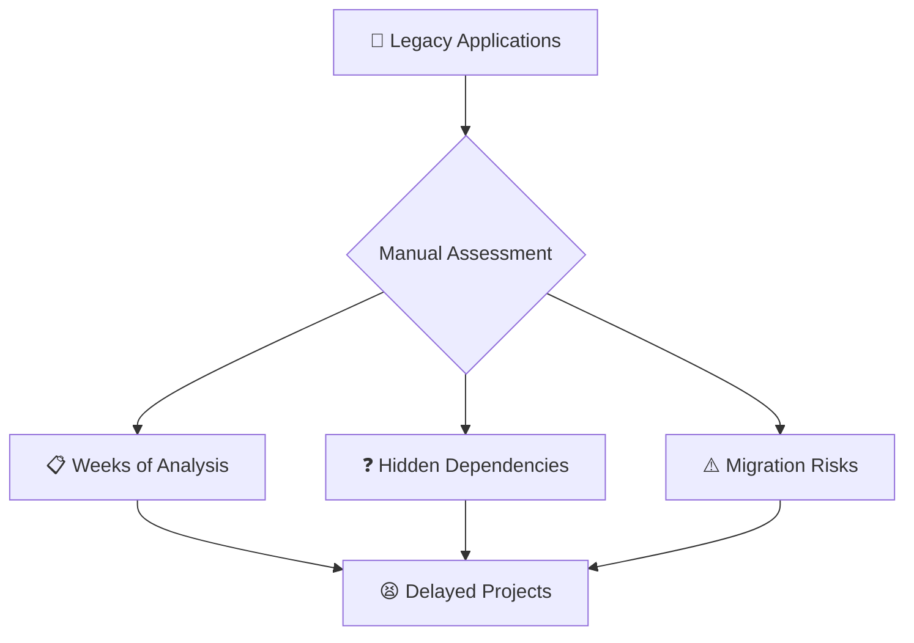

### The Reality
- 70% of enterprise workloads are legacy
- Manual assessment takes 3-6 weeks per app
- 40% of migrations fail due to unknowns

---

## Slide 3: Meet Konveyor


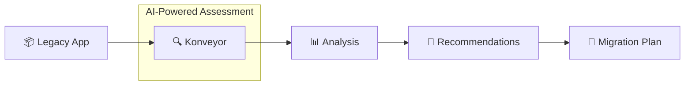

### What is Konveyor?

🎯 **Open-source toolkit**  
🤖 **AI-powered analysis**  
📈 **Red Hat backed**  
 **CNCF Sandbox Project**

---

## Slide 4: Architecture Overview

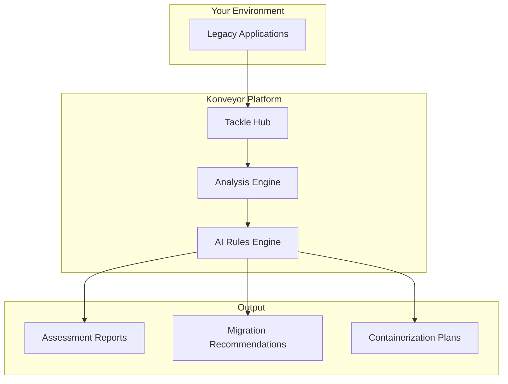

---

## Slide 5: Demo Environment

```ascii
┌─────────────────────────────────────────┐
│             🖥️  Local Setup               │
├─────────────────────────────────────────┤
│                                         │
│  📦 Minikube Cluster                    │
│  ├── 🛠️  Konveyor Operator              │
│  ├── 🎯 Tackle Hub                      │
│  └── 🔍 Analysis Tools                  │
│                                         │
│  📂 Sample Applications                 │
│  ├── ☕ Java Legacy App                 │
│  ├── 🌐 Web Components                  │
│  └── 🗄️  Database Dependencies          │
│                                         │
└─────────────────────────────────────────┘
```

**Ready for live analysis!**

---

## Slide 6: Live Demo - Application Upload

### What We'll See:

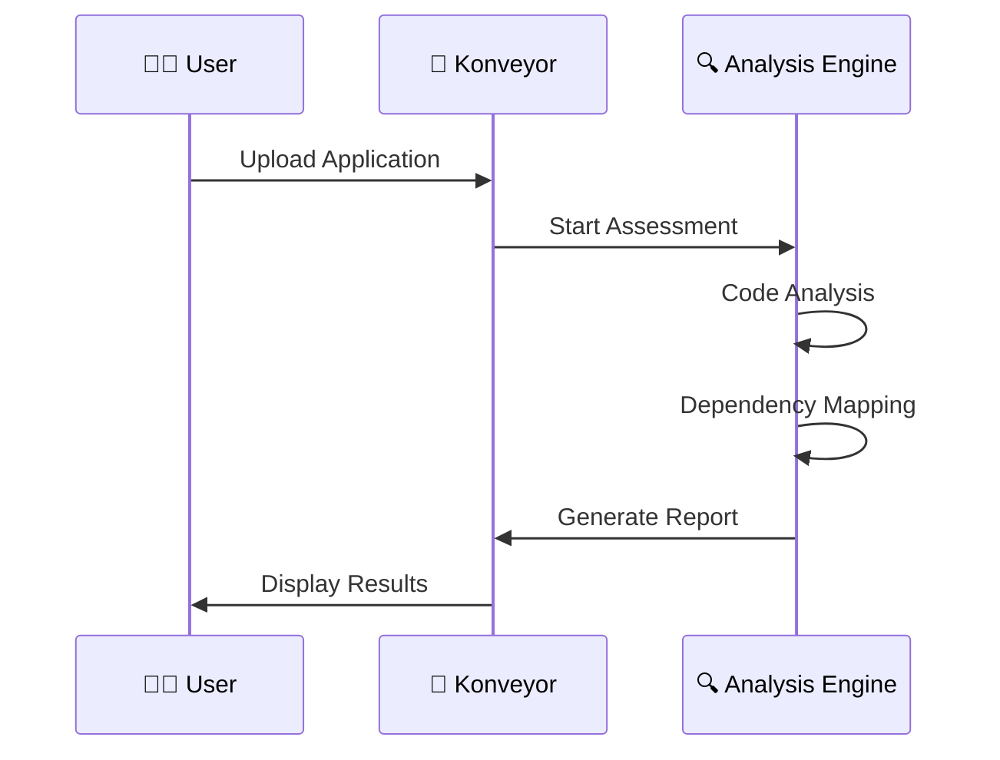

**Application:** Sample Java Web App  
**Size:** ~50MB, 15,000 lines of code

---

## Slide 7: Assessment in Progress

```ascii
🔍 Analyzing Application...

▓▓▓▓▓▓▓▓░░ 80%

Current Phase: Dependency Analysis

✅ Source Code Scan       (Complete)
✅ Framework Detection    (Complete)  
✅ Library Analysis       (Complete)
🔄 Security Scan          (In Progress)
⏳ Container Readiness    (Pending)
⏳ Cloud Suitability      (Pending)
```

*Real-time analysis in action*

---

## Slide 8: Results Dashboard

### Assessment Score: 85/100 🎯

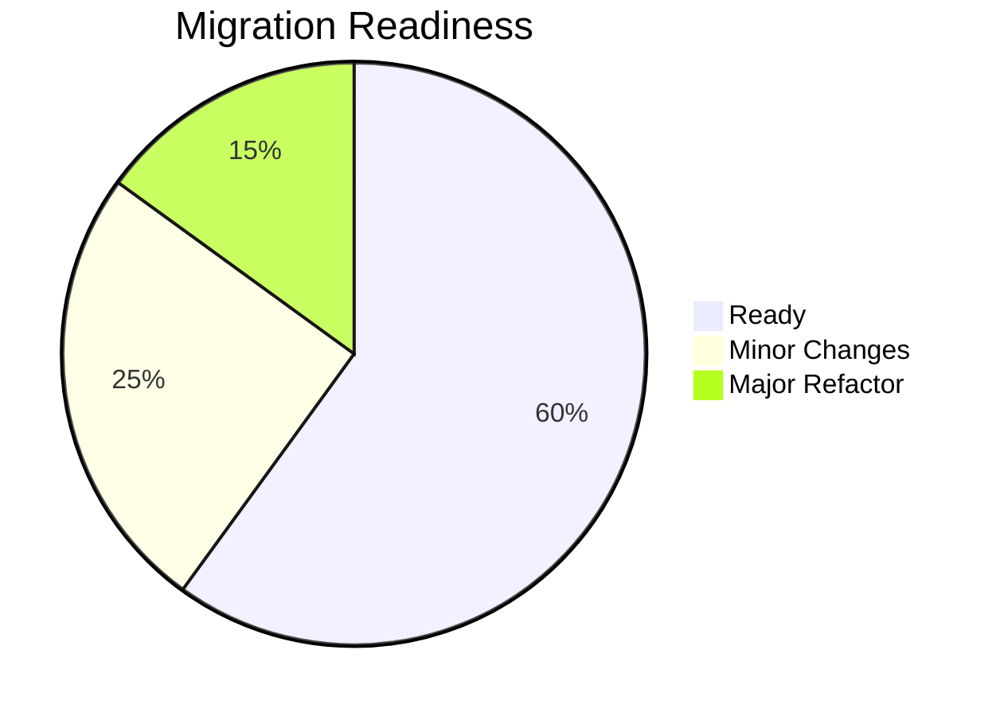

### Key Findings
🟢 **No blocking issues**  
🟡 **3 minor configuration changes**  
🟠 **1 deprecated library to update**

---

## Slide 9: Detailed Analysis

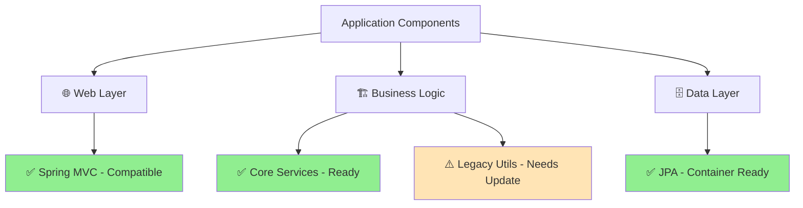

---

## Slide 10: Migration Recommendations

### Suggested Path: **Lift & Shift** → **Optimize**

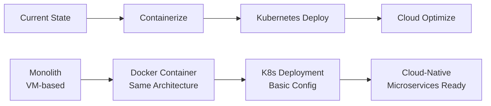

### Timeline: **2-3 weeks**

---

## Slide 11: Dependencies Map

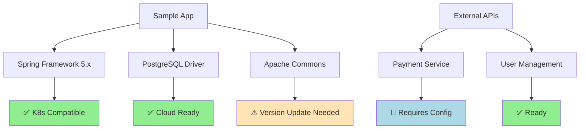

---

## Slide 12: Container Strategy

### Recommended Approach

```dockerfile
# Generated Dockerfile Preview
FROM openjdk:11-jre-slim

COPY app.jar /app/
EXPOSE 8080

# Optimizations suggested:
# - Multi-stage build
# - Security scanning  
# - Resource limits
```

### Benefits
🐳 **Consistent environments**  
📈 **Scalable deployment**  
🔒 **Enhanced security**

---

## Slide 13: Kubernetes Deployment

```yaml
# Generated K8s Resources
apiVersion: apps/v1
kind: Deployment
metadata:
  name: legacy-app
spec:
  replicas: 3
  selector:
    matchLabels:
      app: legacy-app
  template:
    spec:
      containers:
      - name: app
        image: legacy-app:1.0
        ports:
        - containerPort: 8080
        resources:
          requests:
            memory: "256Mi"
            cpu: "250m"
```

**Auto-generated from analysis**

---

## Slide 14: Risk Assessment

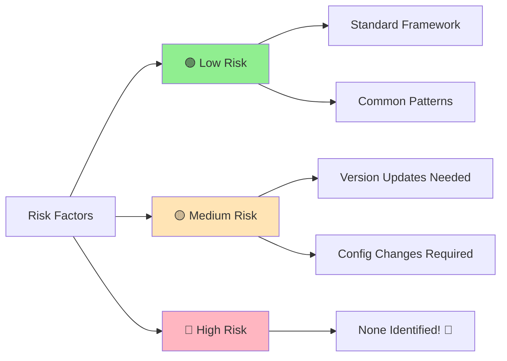

### Migration Confidence: **High** 🎯

---

## Slide 15: Before vs After

### Current Architecture
```ascii
┌─────────────────────┐
│   🖥️  Physical Server │
│                     │  
│   🏢 Legacy App      │
│   🗄️  Local DB       │  
│   📁 File Storage    │
└─────────────────────┘
```

### Target Architecture  
```ascii
┌─────────────────────────────────────┐
│        ☁️  Kubernetes Cluster        │
├─────────────────────────────────────┤
│  🐳 App Pods    │  🗄️  DB Service   │
│  📊 Monitoring  │  📁 Persistent Vol │  
│  🔒 Security    │  🌐 Ingress       │
└─────────────────────────────────────┘
```

---

## Slide 16: Implementation Timeline

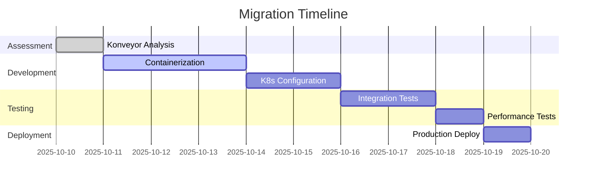

**Total: 2 weeks** ⚡

---

## Slide 17: Key Benefits

### Why Choose Konveyor?

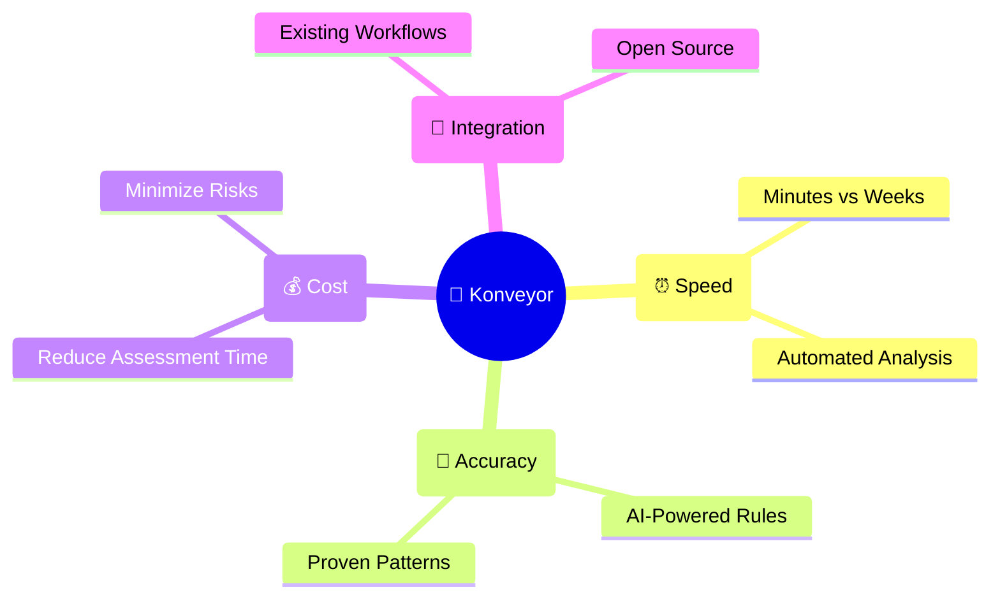

---

## Slide 18: Integration Options

### Fits Your Workflow

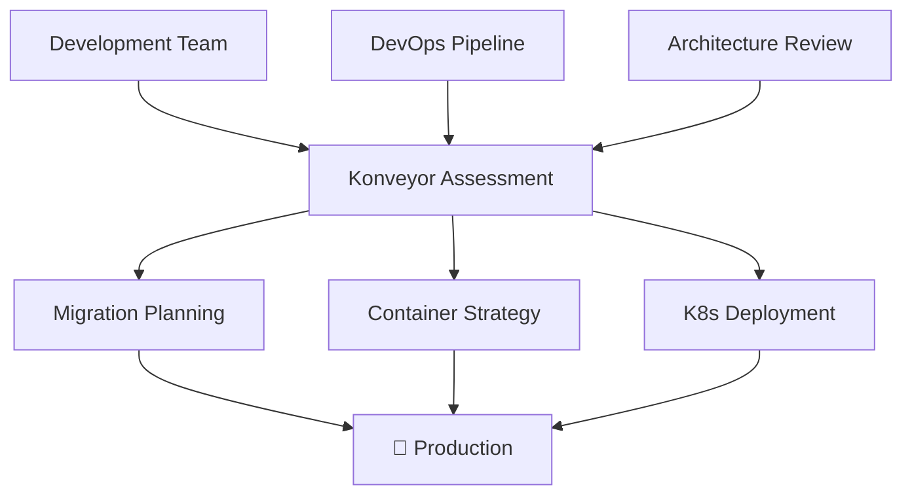

### Supports
✅ **CI/CD Integration**  
✅ **GitOps Workflows**  
✅ **Enterprise Standards**

---

## Slide 19: Getting Started

### Three Simple Steps

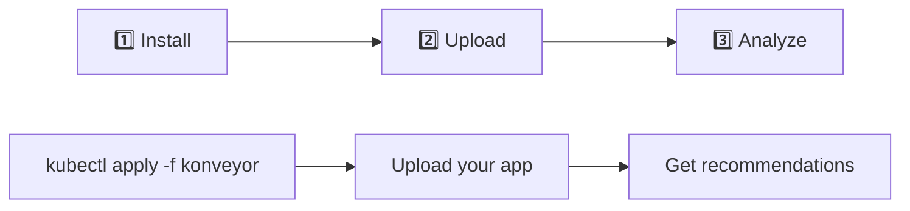

### Resources
📚 **Documentation:** konveyor.io  
🐙 **Source Code:** github.com/konveyor  
💬 **Community:** #konveyor on CNCF Slack

---

## Slide 20: Demo Results Summary

### What We Discovered

```ascii
📊 Assessment Results
├── ✅ 85% Migration Ready
├── ⚡ 2-week timeline  
├── 🐳 Container strategy defined
├── 🎯 Zero blocking issues
└── 📈 Risk: Low

🎉 Ready for Kubernetes!
```

**Next Step:** Start containerization

---

## Slide 21: Q&A

# 🤔 Questions & Discussion

### Popular Topics
- Konveyor vs manual assessment
- Integration with existing tools  
- Enterprise deployment patterns
- Custom rule development

**Let's discuss your use cases!**

---

## Slide 22: Thank You & Resources


# 🙏 Thank You!

### Connect & Learn More

📧 **Mezba Rahman** - mezba.rahman@capgemini.com  
🏢 **Platform Engineering, CIS Capgemini**

### Resources
🌐 **Konveyor Project:** https://konveyor.io  
📖 **Documentation:** https://konveyor.io/docs  
💻 **Demo Repository:** github.com/my-janala/app-modernisation-demo  
🎥 **This Presentation:** [Link to slides]

### Community
💬 **Slack:** #konveyor (CNCF Slack)  
🐦 **Twitter:** @KonveyorIO  
📺 **YouTube:** Konveyor Community

---

## Backup Slide 23: Technical Deep Dive

### Analysis Engine Details

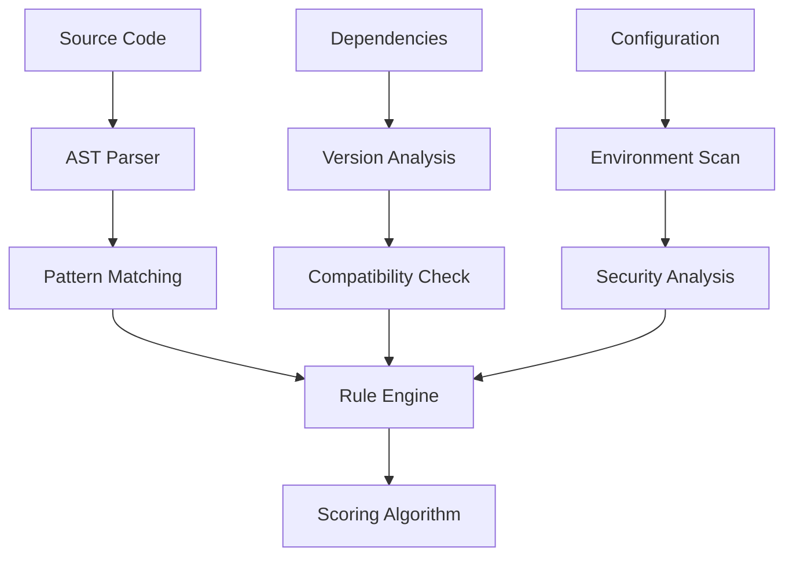

---

## Backup Slide 24: Enterprise Features

### Advanced Capabilities

🏢 **Multi-Application Assessment**  
📊 **Portfolio Analytics**  
🔐 **Enterprise Security**  
📈 **Custom Reporting**  
🔄 **CI/CD Integration**  
👥 **Team Collaboration**

### Pricing Model
🆓 **Open Source Core**  
💼 **Enterprise Support Available**

---

## Backup Slide 25: Comparison Matrix

| Feature | Manual Assessment | Konveyor |
|---------|------------------|----------|
| ⏱️ **Time** | 3-6 weeks | Minutes |
| 🎯 **Accuracy** | Variable | Consistent |
| 📊 **Coverage** | Limited | Comprehensive |
| 🔄 **Repeatability** | Low | High |
| 💰 **Cost** | High | Low |
| 📈 **Scalability** | Poor | Excellent |
