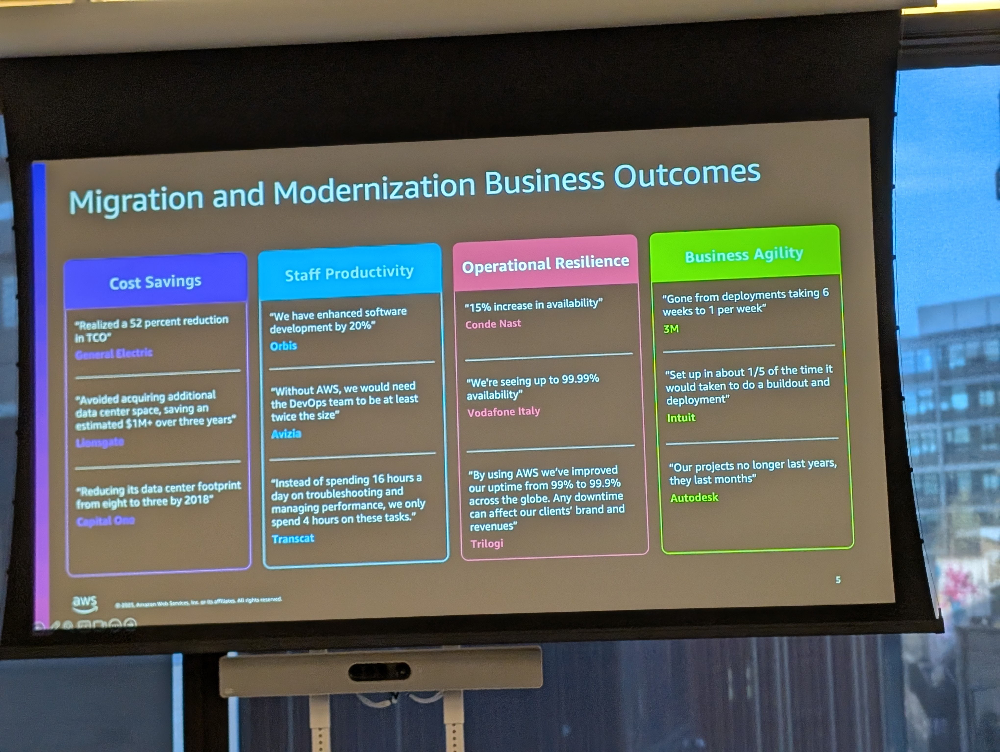
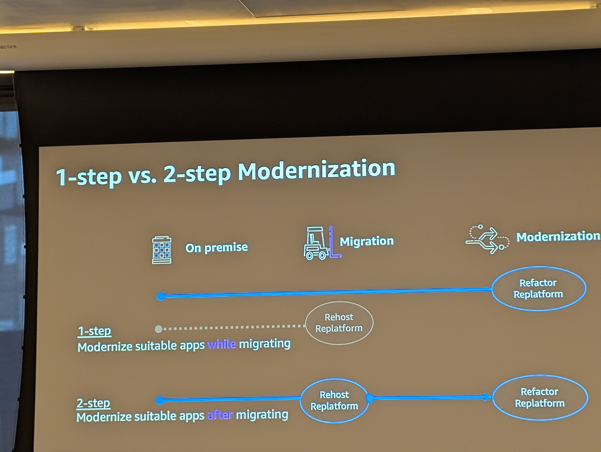
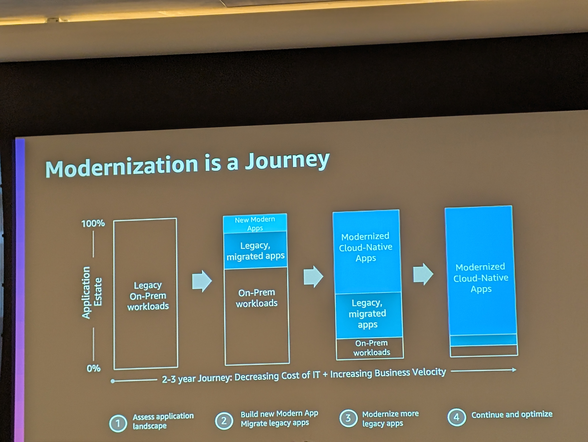
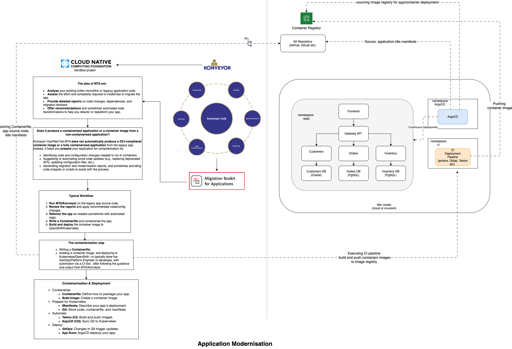

# Modernisation Playbook

Use this playbook to understand the motivation for modernising the legacy Tomcat application, explore Konveyor capabilities, and plan the journey beyond analysis.

## Context: Application Modernisation and Konveyor

Application modernisation transforms legacy systems so they can leverage modern architectures and cloud-native platforms. Benefits include better scalability, reliability, security, and reduced technical debt.

Modernisation is rarely one-size-fits-all. Konveyor helps teams evaluate the classic “Rs” strategies and decide which path fits each workload:

## Quick Reference Table: The "Rs" Strategies

| Strategy    | Definition | Example Use Cases |
|-------------|------------|------------------|
| **Retain**  | Leave as-is when requirements are met | Payroll system with no change needed; regulatory reporting tool |
| **Retire**  | Decommission obsolete apps | Old CRM replaced by new solution; legacy reporting tool |
| **Rehost**  | Move to new infra with minimal changes | Java app to AWS EC2; Tomcat to Kubernetes pod |
| **Replatform** | Incremental platform improvements | MySQL to RDS; monolith to container with managed logging |
| **Refactor** | Restructure for maintainability/scalability | Monolith to microservices; add REST APIs |
| **Repurchase** | Replace with SaaS | Custom HR to Workday; ticketing to Jira |

## The "Rs" of Modernisation: Expanded with Use Cases

### Retain

**Definition:** Leave the application as-is when it continues to meet requirements and delivers value.

**Use Cases:**

- Legacy payroll system with stable requirements and no business change needed.
- Regulatory reporting tool that is rarely updated but must remain accessible for audits.

### Retire

**Definition:** Decommission applications that no longer deliver value or are obsolete.

**Use Cases:**

- Old CRM platform replaced by a new enterprise solution.
- Custom-built reporting tool superseded by modern BI dashboards.

### Rehost ("Lift and Shift")

**Definition:** Move the application to new infrastructure (e.g., cloud or containers) with minimal changes.

**Use Cases:**

- Migrating a Java web app from on-premises VMs to AWS EC2 or Azure VMs.
- Moving a legacy Tomcat application into a Kubernetes pod for easier scaling.

### Replatform ("Lift, Tinker, Shift")

**Definition:** Adopt a new platform while making incremental improvements, such as containerisation or managed services.

**Use Cases:**

- Shifting a database from self-hosted MySQL to Amazon RDS.
- Containerising a monolithic app and using managed logging/monitoring services.

### Refactor ("Re-architect")

**Definition:** Restructure the application for maintainability, scalability, or cloud-native patterns.

**Use Cases:**

- Breaking a monolith into microservices for independent scaling and deployment.
- Refactoring legacy code to use REST APIs and modern authentication.

### Repurchase ("Drop and Shop")

**Definition:** Replace the legacy application with a modern SaaS solution.

**Use Cases:**

- Moving from a custom HR system to Workday or BambooHR.
- Replacing an in-house ticketing system with Jira or ServiceNow.

Konveyor delivers automated analysis and actionable recommendations so teams can modernise at their own pace.

---
## App Modernisation is a Journey

   
    
   <em>Figure 1: Modernisation begins with collaborative planning and assessment.</em>

Modernisation is not a single event—it’s a journey. Teams move from legacy to modern platforms in stages, learning and adapting as they go.

---
## Stepwise Modernisation: From 1-Step to 2-Step

> **Key Decision:**
> - Choose **one-step migration** for simple apps or when rapid transformation is needed.
> - Choose **two-step migration** for complex, business-critical workloads where risk mitigation and staged delivery are important.

   
    
   <em>Figure 2: Visualising the transition from legacy to cloud-native in incremental steps.</em>

Some organisations move directly from legacy to cloud-native (1-step). Others take a phased approach, first rehosting, then refactoring or replatforming (2-step).

---
## Migration and Modernisation Business Outcomes

**Case Study Example:**

- After migrating a legacy monolith to Kubernetes and refactoring into microservices, Company X reduced infrastructure costs by **30%**, improved deployment frequency from monthly to **daily**, and cut incident response times by **50%**.

### Glossary of Key Terms

- **CRD (Custom Resource Definition):** Extension of Kubernetes API to define custom objects.
- **CI/CD (Continuous Integration/Continuous Deployment):** Automated process for building, testing, and deploying code.
- **Replatform:** Moving an app to a new platform with incremental improvements.
- **Refactor:** Restructuring code for maintainability, scalability, or cloud-native patterns.
- **ConfigMap:** Kubernetes object for storing non-confidential configuration data.
- **Secret:** Kubernetes object for storing sensitive data (passwords, tokens).
- **Namespace:** Logical partition in Kubernetes for organizing resources.
- **SaaS (Software as a Service):** Cloud-based software delivered via subscription.

### Pre-Migration Checklist

- [ ] Minikube or Kubernetes cluster running and accessible
- [ ] Ingress and OLM addons enabled (or manual OLM installed)
- [ ] Konveyor operator installed and running
- [ ] Required CRDs present (e.g., tackles.tackle.konveyor.io)
- [ ] Tackle instance created
- [ ] Access to Konveyor UI
- [ ] Application source code or export available
- [ ] Team alignment on migration strategy (one-step vs. two-step)
- [ ] Backup and rollback plan in place
- [ ] Stakeholder communication and sign-off

   
    
   <em>Figure 3: Business and technical teams celebrate the outcomes of a successful modernisation journey.</em>

Key outcomes include:
- Reduced operational costs
- Improved scalability and reliability
- Enhanced security and compliance
- Faster time-to-market for new features
- Increased agility and innovation

---

## Why Modernise a Legacy Tomcat Application?

The `example-1` Tomcat application represents workloads still running on traditional infrastructure. Common pain points include:

- Operational complexity from manual server/VM management.
- Limited scalability and elasticity.
- Security gaps due to slow patch cadences.
- High maintenance costs and specialised skills requirements.
- Limited agility when integrating with modern services or CI/CD pipelines.
- Accumulating technical debt.

Modernising with Konveyor enables migrations to Kubernetes, improved reliability, lower operational cost, and faster iteration cycles.

## About Konveyor and KAI

Konveyor is an open-source toolkit that accelerates application modernisation through automated analysis, planning, and transformation. Key components include **Tackle**, **Konveyor Hub**, **Konveyor CLI**, and **Konveyor AI (KAI)**. Red Hat’s Migration Toolkit for Applications (MTA) builds on Konveyor and adds enterprise support.

### Dedicated KAI Section

KAI augments the stack with AI-assisted insights:

- Deep code and configuration analysis using LLMs.
- Actionable recommendations for refactoring, replatforming, and containerisation.
- Guidance on LLM selection and prompt tuning; see the [LLM selection guidelines](https://github.com/konveyor/kai/blob/main/docs/llm_selection.md).
- Continuous improvement as feedback is incorporated.

## More About Konveyor

Konveyor’s methodology encourages portfolio assessment, iterative modernisation, and collaboration. Major toolkit elements include:

- **Tackle:** Assessment and migration planning.
- **KAI:** AI-powered analysis and recommendations.
- **Move2Kube:** Automated containerisation/Kubernetes asset generation.
- **Forklift:** VM and infrastructure migration.
- **Konveyor Hub:** Centralised planning and execution hub.
- **Konveyor CLI:** Automation and integration entry point.

Reasons to adopt Konveyor:

- Accelerated modernisation with proven rulesets.
- Cloud-native readiness.
- Open-source, community-driven roadmap.
- End-to-end guidance from assessment to execution.

## Next Steps After Analysis

Once the analyzer highlights issues, the diagram below guides the next steps for a successful modernisation journey:

*Figure 4: Workflow after a Konveyor analysis.*

**1. Automated Analysis (MTA):**
   - Use Migration Toolkit for Applications (MTA) to scan code, identify dependencies, and surface transformation opportunities.
   - Supported runtimes include Java EE, .NET, and more.

**2. Centralised Planning (Konveyor Hub):**
   - Review analysis results in Konveyor Hub.
   - Categorise findings into blockers, quick wins, and strategic priorities.
   - Collaborate across teams to update assessments and plan remediation.

**3. Remediation & Transformation:**
   - Create actionable tasks: configuration updates, code refactors, dependency upgrades, and platform changes.
   - Assign tasks and track progress in the Hub.

**4. Containerisation & CI/CD Automation:**
   - Containerise applications using Move2Kube or manual Dockerfiles.
   - Integrate with CI/CD pipelines (Tekton, Argo CD) for automated build, test, and deployment.
   - Insert security and quality gates (Trivy, SonarQube) as needed.

**5. Iterative Execution & Deployment:**
   - Deploy modernised workloads to cloud-native platforms (Kubernetes, OpenShift).
   - Use namespaces to organise microservices, databases, and APIs (e.g., `retail`, `argocd`).
   - Monitor, validate, and iterate for continuous improvement.

**6. Business Alignment & Reporting:**
   - Generate reports to demonstrate progress, business impact, and technical outcomes.
   - Use feedback loops to refine strategy and ensure alignment with business goals.

This process is iterative—teams revisit analysis, planning, and execution as new requirements and opportunities arise. The diagram provides a visual roadmap for moving from legacy to modern, cloud-native architectures.

## References

- [Konveyor](https://konveyor.io/)
- [Konveyor Methodology](https://github.com/konveyor/methodology)
- [Konveyor Modernization Report](https://konveyor.io/modernization-report/)
- [Migration Toolkit for Applications](https://developers.redhat.com/products/mta/overview)
- [Kube by Example: Install Konveyor and Analyse Legacy Java Application](https://kubebyexample.com/learning-paths/migrating-kubernetes/install-konveyor-and-analyse-legacy-java-application)

